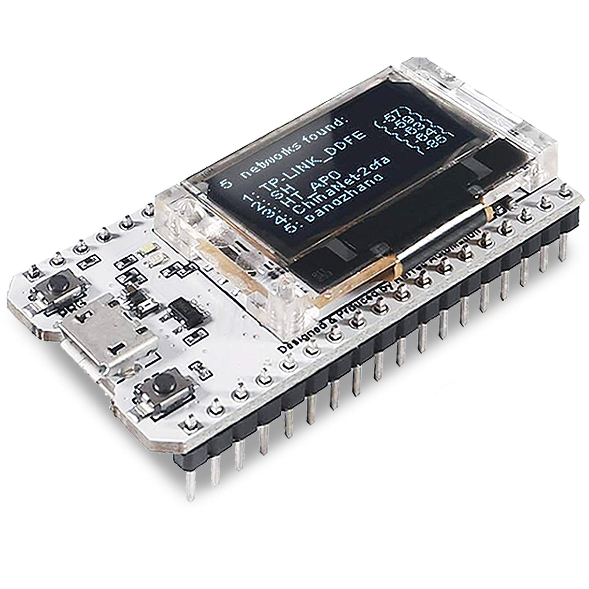
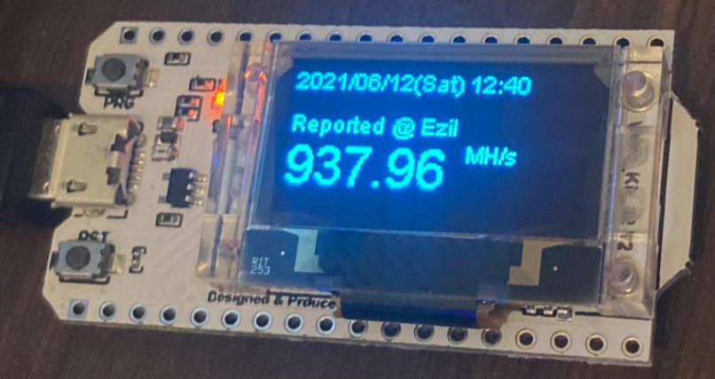

# Heltec EZIL monitor

This script monitors your Ethereum mining hashrate on EZIL pool every 10 minutes with Heltec Wifi Kit 32.

## How to use

1. Copy from define.h.template to define.h
2. Edit the Wifi and EZIL account settings in define.h
3. Compile and upload 

## Reference

- https://ezil.me/
- https://github.com/HelTecAutomation/Heltec_ESP32.git
- https://heltec-automation-docs.readthedocs.io/en/latest/esp32%2Barduino/wifi_kit_32/hardware_update_log.html
